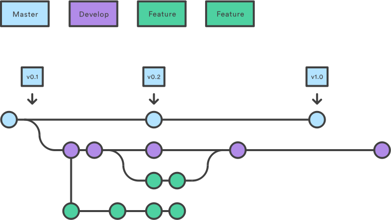

# :octocat: Git branch

This repository is part of my study of `git branches` and all codes are simple examples that represent changes in a real code. The most important thing with this is understand how to merge branches and how to apply it with **git flow** in larger projets.

## :palm_tree: git branch
- Duplicate object
- Distinct changes
- Developer a feature
- Branch `master` clean

We can use [Visualizing Git](https://git-school.github.io/visualizing-git/) to visualize how the commits and branchs work in a git repository



### git commands
- flag `-b` in `checkout` command are used for create a new branch
- When we merge two branch is created a new commit (dirt commit) 
- Alternative to the `git merge` is use `git rebase`

 ```sh
$ git branch <name>
$ git checkout <branch>
 ```